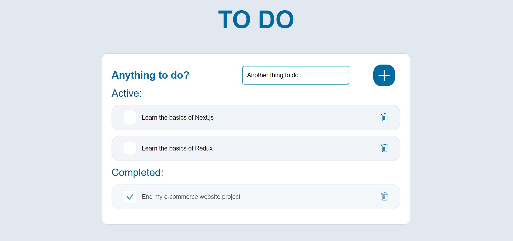

  <a href="https://github.com/LychakVlad/react-todo-app" target='_blank'>

 

  <a href="https://lychakvlad.github.io/react-todo-app/" target='_blank'>
    

<h3 align="center">To do list app</h3>

  

    An app I created using React and Tailwind
     
    <a href="https://github.com/LychakVlad/react-todo-app"><strong>Explore the code »</strong></a>
     
     
    <a href="https://lychakvlad.github.io/react-todo-app/">View Demo</a>
  

<!-- ABOUT THE PROJECT -->

## About The Project

Todo list app built using React. The application allows users to create and manage their to-do list with features such as adding and deleting tasks. The project includes a simple, yet modern user interface that provides a responsive design for optimal user experience on both desktop and mobile devices.

### Built With

- REACT JS
- HTML5
- TAILWIND

## Contact

Vladislav Lychak - [@LinkedIn](https://www.linkedin.com/in/vladislav-lychak/) - lycakvladislav@gmail.com

Project Link: [https://github.com/LychakVlad/react-todo-app](https://github.com/LychakVlad/react-todo-app)

(<a href="#readme-top">back to top</a>)

<!-- MARKDOWN LINKS & IMAGES -->
<!-- https://www.markdownguide.org/basic-syntax/#reference-style-links -->

[react.js]: https://img.shields.io/badge/React-20232A?style=for-the-badge&logo=react&logoColor=61DAFB
[react-url]: https://reactjs.org/
